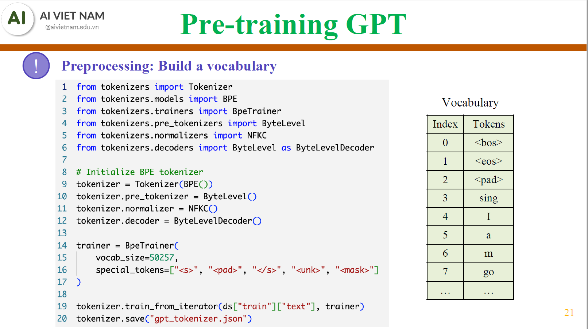

# Tree of Thought: group of experts


    Imagine three different experts are independently solving the question.
    All experts will write down 1 step of their thinking, then share it with the group
    Then all experts will go on to the next step, etc.
    If any expert realises ther're wrong at any point, they leave.

# Overview of training LLMs

## Tokenization with Byte Pair Encoding (BPE)



## Metrics (TODO)
### Perplexity

### ROUGE (Recall-Oriented Understudy for Gisting Evaluation)
- Evaluates **recall**: how much of the reference text appears in the generated output.  
- Often used in **text summarization**.

🔸 **ROUGE-N** (n-gram Recall): measures overlap of n-grams between candidate and reference.

```math
\text{ROUGE-N} = \frac{\sum_{\text{ngram} \in \text{Ref}} \text{Count}_{\text{match}}(\text{ngram})}{\sum_{\text{ngram} \in \text{Ref}} \text{Count}(\text{ngram})}
```

🔸 **ROUGE-L** (Longest Common Subsequence): measures the longest sequence of words shared between candidate and reference.
```math
P = \frac{LCS(X, Y)}{|Y|}, \quad
R = \frac{LCS(X, Y)}{|X|}, \quad
F_1 = \frac{(1 + \beta^2)PR}{R + \beta^2 P}
```
Where
- $X$: reference text  
- $Y$: candidate text  
- $\beta$: weight between precision $P$ and recall $R$ (usually $1$)
### BLEU (Bilingual Evaluation Understudy)
Measures n-gram **precision** between candidate and reference.
```math
\text{BLEU} = \text{BP} \cdot \exp\left( \sum_{n=1}^N w_n \log p_n \right)
```
Where:  
- **BP** (Brevity Penalty):

```math
\text{BP} = \begin{cases}
1 & \text{if } c > r \\
e^{(1 - \frac{r}{c})} & \text{if } c \leq r
\end{cases}
```
- $p_n$ = precision of n-grams  
- $w_n = \dfrac{1}{N}$ (equal weights)  
- $c$ = candidate length, $r$ = reference length
# Parameter-Efficient Fine-Tuning (PEFT)
## Prefix Tuning
Add **a set** of small, continuous, task-specific, learnable vectors (the *"prefixes"*) to the **hidden states at each layer**.


## Prompt Tuning
Prepend **a** small, continuous, task-specific, learnable vector (the *"soft prompt"*) to the **input embedding layer**.


## Instruction Tuning
May not be parameter-efficient, but is a form of fine-tuning. The LLM is trained on a dataset of **(instruction, output)** pairs. The goal is to teach the model to follow human instructions better.  
The subtle difference is the framing of the training data set. When a user asks a similar question, the output answer aligns more with the correct response.

## Quantization


## Low-Rank Adaptation (LoRA)


## Quantized LoRA (QLoRA)
[QLORA:Efficient Finetuning of Quantized LLMs](https://arxiv.org/pdf/2305.14314)
- **Low-Rank Adapters (LoRA)**
- **Block-wise k-bit Quantization**: group the weights of the model into blocks and quantize each block separately.


- **Double Quantization**: to further save memory, the quantization constants themselves are also quantized


- **Storage Data Type NormalFloat4**: instead of using uniformly distributed 4-bit integers, QLoRA uses a custom data type called NormalFloat4, which is distributed normally around zero.


- **Paged Optimizers**: to manage memory spikes during training, QLoRA uses paged optimizers, which offload optimizer states to CPU RAM when GPU memory is full.


## Example notebook
[PEFT_example.ipynb](PEFT_example.ipynb)


# Reinforcement Learning (PTODO)
## Overview
## Policy-based optimization:
```math
\pi_\theta(S_t)=\hat{A}_{t+1} \\
       \Rightarrow \theta^* \text{ (using policy gradients)} \\
        \Rightarrow \pi_{\theta^*}(S_t)
```
## Value-based optimization:
```math
\pi(S_t) = V(S_t, A_t) \\
\begin{array}{ c |  c |  c |  c }
    & A_0 & A_1 & A_2 \\
\hline
S_0 & * & * & * \\ 
\hline
S_1 & * & * & * \\
\hline  
S_2 & * & * & *\\
\hline    
\end{array}
```

## Training with GRPO
