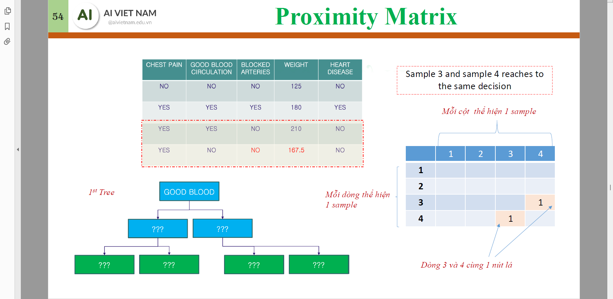

# Decision Tree
## Classification Tree
### Gini Impurity
```math
\text{Gini}(D_i) = 1 - \sum_{j = 1}^{k} p_j^2
```
Minimize 
```math
\text{Gini}(D) = \sum_i w_i\text{Gini}(D_i)
```
### Entropy & Information Gain
```math
\text{Entropy}(D_i) = -\sum_{j = 1}^k p_j \log_2 p_j
```
Maximize
```math
\text{Information Gain}(D) = \text{Entropy}(D) - \sum_i w_i\text{Entropy}(D_i)
```
## Regression Tree
Use Mean Squared Error (MSE) as the impurity measure.
## Branching for continious variables

## Pruning


Minimize "Tree Score" by pruning the depth.
## Prediction
Mean of the leaves for regression and majority vote for classification.

# Ensemble Learning 
## Homogenous
### Bagging 

### Boosting

## Heterogenous
### Stacking


# Random Forest
## Flow
- For each **tree** in the **forest**
    - Create **bootstrapped** dataset: $N$ sampled datapoints (with replacement).
    - While there are columns left
        1. For each level of depth, choose 2 columns only to create tree.
        1. Choose the optimal column to create the first node and perform seggregation.
        1. Remove the column chosen.

## Fill missing data
1. Fill missing data with majority or mean.
    
1. Form **Proximity matrix** of $N\times N$ using Random Forest: in each iteration, calculate the number of samples clustered with the sample with missing data, without any awareness of the missing columns.
    
    

1. Normalize the **Proximity matrix** by the number of trees.
    
    
1. Re-fill the missing data with weighted value.
    
    
    
    

# AdaBoost

Create stumps (trees with depth of 1) $T^{(i)}$ that are weak classifiers. The next tree will focus on the misclassified data points $x_j$ of the previous tree by updating (increasing) the probability to sample those points ($w_j$). The final prediction is a weighted sum of all the trees.
## Calculate $\text{Amount of Say}_{T^{(i)}}$
```math
\text{Amount of Say}_{T^{(i)}} = \dfrac{1}{2} \log \left( \frac{1 - \text{Error}_{T^{(i)}}}{\text{Error}_{T^{(i)}}} \right) = \dfrac{1}{2} \log \left(\text{Odds}_{T^{(i)}} \right)
```
## Update the sampling probability $w_j$
### $y\in \{-1,1\}$
```math
w_j = \begin{cases}
    w_j \times \exp\left(\text{Amount of Say}_{T^{(i)}}\right) & \text{if } y_j \text{ is misclassified} \\
    w_j \times \exp\left(-\text{Amount of Say}_{T^{(i)}}\right) & \text{if } y_j \text{ is classified correctly}
\end{cases}
```


### $y\in \{0,1\}$
```math
w_j = \begin{cases}
    w_j \times \exp\left(\text{Amount of Say}_{T^{(i)}}\right) & \text{if } y_j \text{ is misclassified} \\
    w_j  & \text{if } y_j \text{ is classified correctly}
\end{cases}
```

## Normalize $w_j$ and resample data for the next stump


## Prediction
```math
\text{Prediction} = 
\begin{cases}
\sum_{i=1}^{M} \text{Amount of Say}_{T^{(i)}} \cdot T^{(i)}(x) & \text{regression} \\
\argmax_{c} \sum_{i=1}^{M} \text{Amount of Say}_{T^{(i)}} \cdot \mathbb{I}(T^{(i)}(x) = c) & \text{classification}
\end{cases}
```
where $M$ is the number of trees.
## Python notebook
[AGBoost.ipynb](Source%20Codes/Ada-Gra%20Boost/AGBoost.ipynb)

# Gradient Boosting
<!-- TODO: resolve the relationship between logits, probabilities and gradients-->
## Overview
Gradient Boosting is an ensemble technique that builds models sequentially. Each new model is trained to correct the errors (pseudo-residuals) made by the previous models.
```math
\text{Pseudo-residuals}_m(x) = r_{m}(x) = -\frac{\partial \mathcal{L}(y, F_{m-1}(x))}{\partial F_{m-1}(x)}
```
where $\mathcal{L}$ is the loss function, $y$ is the true label, and $F_{m-1}(x)$ is the prediction from the previous model.  
Note that the pseudo-residuals are the negative gradients of the loss function with respect to the predictions of the previous model. This means that the new model is trained to predict the direction in which the previous model's predictions need to be adjusted to minimize the loss.  
 Pseudo-residuals are in the **gradient space**, not the label space, hence the prefix "pseudo".

## Flow
1. Initialize the model with a constant value for target (*mean* for regression, *log-probability/logits* for classification (which is commonly set to $0$)).
   ```math
   r_0(x)=\begin{cases}
         \text{mean}(y) & \text{for regression} \\
         0 & \text{for classification}
   \end{cases}
   ```
2. For each iteration/model $m\coloneqq1\ldots M$:
   1. Compute the pseudo-residuals.
    ```math
    r_m(x_i) = y_i - F_{m-1}(x_i) \text{ (if $\mathcal{L}$ is MSE)}
    ```
   2. Fit a new model (for regression tasks and binary classification tasks) / $C$ new models (for classification tasks with $C>2$ classes) to the pseudo-residuals (use *mean* for both regression and classification for leaves of the same parent (resulting from the optimization of MSE)).
   3. Update the output of the model by adding the new model's predictions to the previous model's predictions.

## Update
```math
F_{m}(x) 
= F_{m-1}(x) + \gamma h_m(x)
```
where $h_m(x)$ is the output of the new model and $\gamma$ is the step size/learning rate.  
For regression, $F_m, F_{m-1}$ are in the label space.  
For classification, $F_m, F_{m-1}$ are in the log-odds/logits space. Use softmax to convert logits to probabilities.

## Example
### Regression

In the above example, $\gamma\coloneqq\nu=0.1$ is the learning rate, $h_m(x_i)\coloneqq \sum_{j=1}^{J_m} \gamma_{jm}\mathbb{I}(x_i\in R_{jm})$ is the output of the new model, $J_m$ is the number of leaves of the new model, $R_{jm}$ is the $j$-th leaf of the new model.
```math
\begin{align*}
F_0(x_0) &= F_0(x_1) = F_0(x_2) = \text{mean}(y) \\
&= \dfrac{88+76+56}{3}\approx 73.33\\
\hline
r_1 &= y - F_0(x) \\
&= \begin{pmatrix} 14.7 & 2.7 & -17.3 \end{pmatrix}\\
h_1(x_0) &= -17.3\\
h_1(x_1) &= h_1(x_2) \\
&= \dfrac{14.7 + 2.7}{2} = 8.7\\
F_1(x_0) &= F_0(x_0) + \nu h_1(x_0)\\
&= 73.33 + 0.1 \cdot (-17.3) \approx 71.6\\
F_1(x_1) &= F_0(x_1) + \nu h_1(x_1)\\
&= 73.33 + 0.1 \cdot 8.7 \approx 74.6\\
\hline
r_2 &= y - F_1(x) \\
&= \begin{pmatrix} 16.4 & 1.4 & -18.6 \end{pmatrix}\\
\ldots
\end{align*}
```
### Classification (multi-class)

|       | Size (kg) | Dog | Cat | Bird |
|-------|-----------|-----|-----|------|
| $x_0$ | 10        | 1   | 0   | 0    |
| $x_1$ |$\ldots$|

Note that the $F_m$ is in the log-odds/logits space, not the label space. The softmax function is used to convert logits to probabilities.

---
**Iteration 0: Set log-odds to $0$**
```math
\begin{align*}
F_0(x_0) &\coloneqq \begin{pmatrix} 0 & 0 & 0 \end{pmatrix}\\
\Rightarrow P_0(x_0) 
&= \text{softmax}(F_0(x_0)) \\&= \begin{pmatrix} 1/3 & 1/3 & 1/3 \end{pmatrix}
\end{align*}
```
---
**Iteration 1: Training Tree 1 for each class**

1.  **Calculate Pseudo-Residuals (Gradients):**.

    ```math
    \begin{align*}
    r_1(x_0) &= y - P_0(x_0) \\
    &= \begin{pmatrix} 1-1/3 & 0-1/3 & 0-1/3 \end{pmatrix}\\
    &= \begin{pmatrix} 2/3 & -1/3 & -1/3 \end{pmatrix}
    \end{align*}
    ```

1.  **Train Three Regression Trees:**
    * **Tree 1 (for Dog):** Trained to predict $2/3$ for Size=10. Let's say this tree outputs $f_1(Size=10) = 0.5$.
    * **Tree 2 (for Cat):** Trained to predict $-1/3$ for Size=10. Let's say this tree outputs $f_2(Size=10) = -0.2$.
    * **Tree 3 (for Bird):** Trained to predict $-1/3$ for Size=10. Let's say this tree outputs $f_3(Size=10) = -0.2$.
    ```math
    \begin{align*}
    h_1(x_0) &= \begin{pmatrix} f_1(10) & f_2(10) & f_3(10) \end{pmatrix} \\
    &= \begin{pmatrix} 0.5 & -0.2 & -0.2 \end{pmatrix}\\
    \end{align*}
    ```

2.  **Update Log-Odds (with Learning Rate $\gamma=0.1$):**
    ```math
    \begin{align*}
    F_1(x)
    &= F_0(x) + \gamma h_1(x) \\
    &= \begin{pmatrix} 0 & 0 & 0 \end{pmatrix} + 0.1 \cdot \begin{pmatrix} 0.5 & -0.2 & -0.2 \end{pmatrix}\\
    &= \begin{pmatrix} 0.05 & -0.02 & -0.02 \end{pmatrix}\\
    \end{align*}
    ```
    

3.  **Calculate New Probabilities (Softmax):**
    ```math
    \begin{align*}
    P_1(x_0) &= \text{softmax}(F_1(x_0)) \\
    &= \begin{pmatrix} e^{0.05}/Z & e^{-0.02}/Z & e^{-0.02}/Z \end{pmatrix}\\
    &\approx \begin{pmatrix} 0.349 & 0.325 & 0.325 \end{pmatrix}\\
    Z &= e^{0.05} + 2e^{-0.02} \approx 1.143
    \end{align*}
    ```

---

**Iteration 2: Training Tree 2 for each class**

1.  **Calculate New Pseudo-Residuals (Gradients):**
    ```math
    \begin{align*}
    r_2(x_0) &= y - P_1(x_0) \\
    &= \begin{pmatrix} 1-0.349 & 0-0.325 & 0-0.325 \end{pmatrix}\\
    &= \begin{pmatrix} 0.651 & -0.325 & -0.325 \end{pmatrix}
    \end{align*}
    ```

2.  **Train Three New Regression Trees:**
    Each tree is trained to predict these new pseudo-residuals based on the input features (Size=10). Let their outputs be $g_1(10)=0.4$, $g_2(10)=-0.2$, $g_3(10)=-0.2$.
    ```math
    \begin{align*}
    h_2(x_0) &= \begin{pmatrix} g_1(10) & g_2(10) & g_3(10) \end{pmatrix} \\
    &= \begin{pmatrix} 0.4 & -0.2 & -0.2 \end{pmatrix}\\
    \end{align*}
    ```

3.  **Update Log-Odds:**
    Add $\eta \cdot g_k(10)$ to the *previous* log-odds.
    ```math
    \begin{align*}
    F_2(x_0) &= F_1(x_0) + \eta h_2(x_0) \\
    &= \begin{pmatrix} 0.05 & -0.02 & -0.02 \end{pmatrix} + 0.1 \cdot \begin{pmatrix} 0.4 & -0.2 & -0.2 \end{pmatrix}\\
    &= \begin{pmatrix} 0.09 & -0.04 & -0.04 \end{pmatrix}
    \end{align*}
    ```

4.  **Calculate New Probabilities (Softmax):**
    ```math
    \begin{align*}
    P_2(x_0) &= \text{softmax}(F_2(x_0)) \\
    &= \begin{pmatrix} e^{0.09}/Z & e^{-0.04}/Z & e^{-0.04}/Z \end{pmatrix}\\
    &\approx \begin{pmatrix} 0.363 & 0.319 & 0.319 \end{pmatrix}\\
    Z &= e^{0.09} + 2e^{-0.04} \approx 3.016
    \end{align*}
    ```
## Python notebook
[AGBoost.ipynb](Source%20Codes/Ada-Gra%20Boost/AGBoost.ipynb)

# XGBoost
