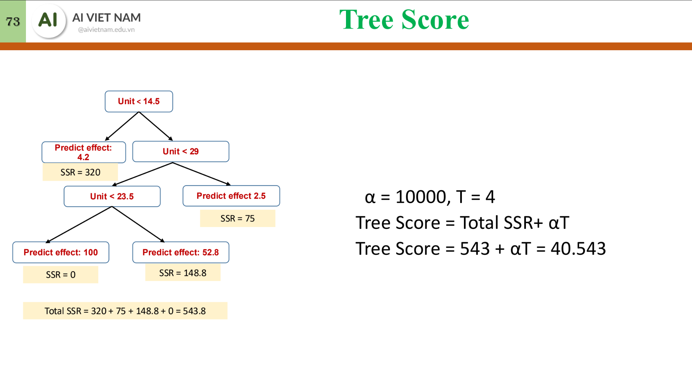
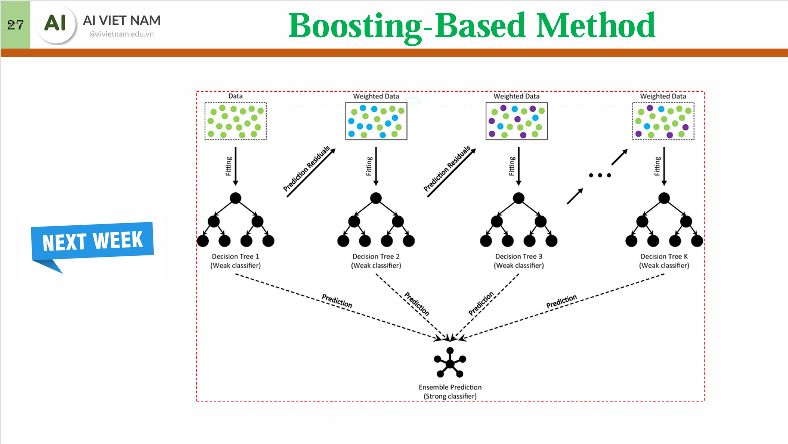
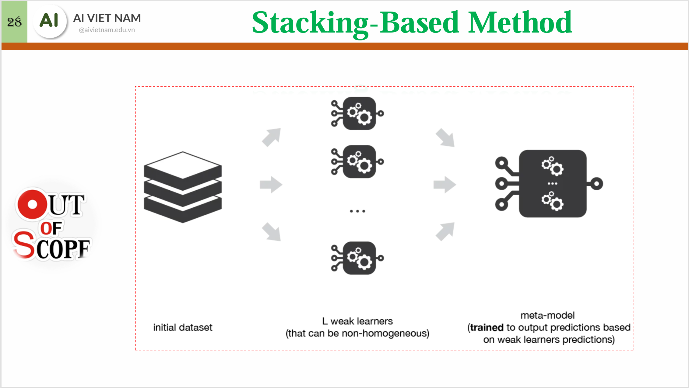

# Decision Tree
## Gini Impurity
$$\text{Gini}(D_i) = 1 - \sum_{j = 1}^{k} p_j^2$$
Minimize 
$$\text{Gini}(D) = \sum_i w_i\text{Gini}(D_i)$$
## Entropy & Information Gain
$$\text{Entropy}(D_i) = -\sum_{j = 1}^k p_j \log_2 p_j$$
Maximize
$$\text{Information Gain}(D) = \text{Entropy}(D) - \sum_i w_i\text{Entropy}(D_i)$$
## Classification for continious variables

## Pruning

Minimize "Tree Score" by pruning the depth.

# Ennsemble Learning
## Homogenous
### Bagging

### Boosting

## Heterogenous
### Stacking
