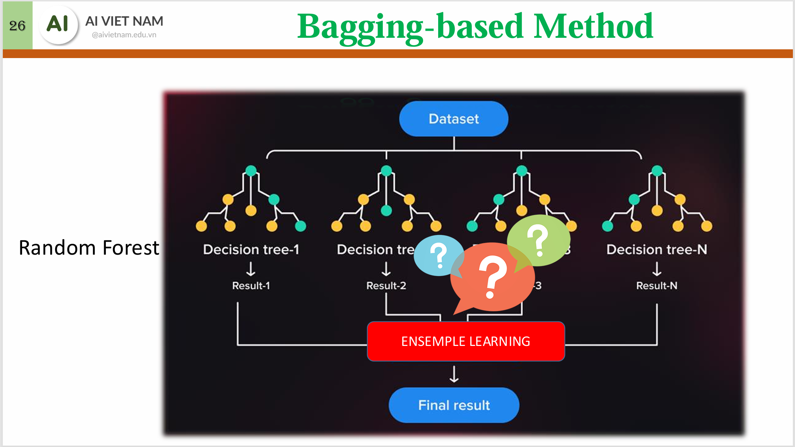
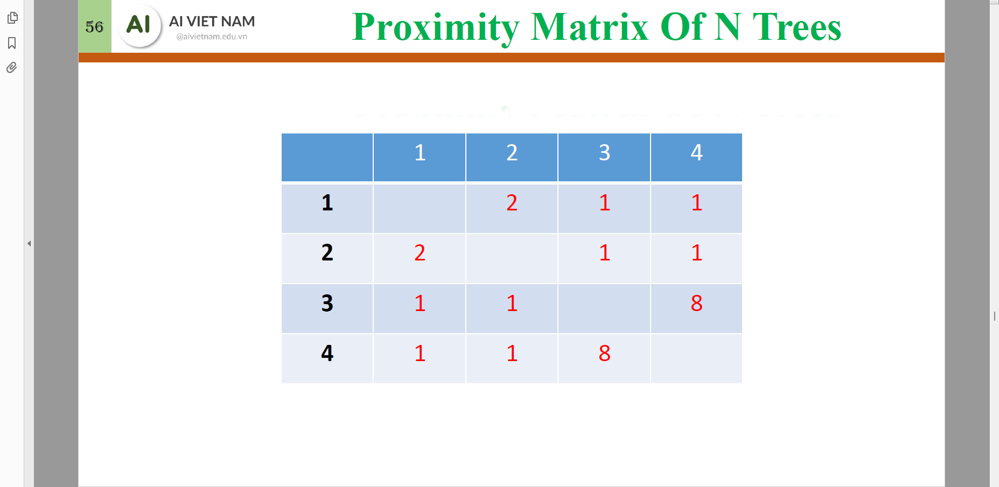
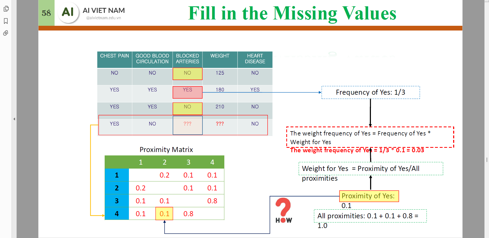
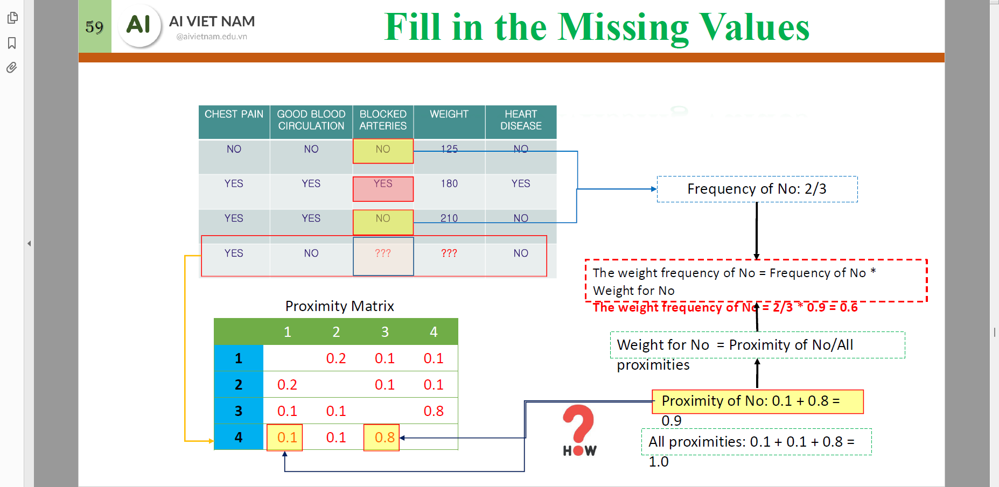
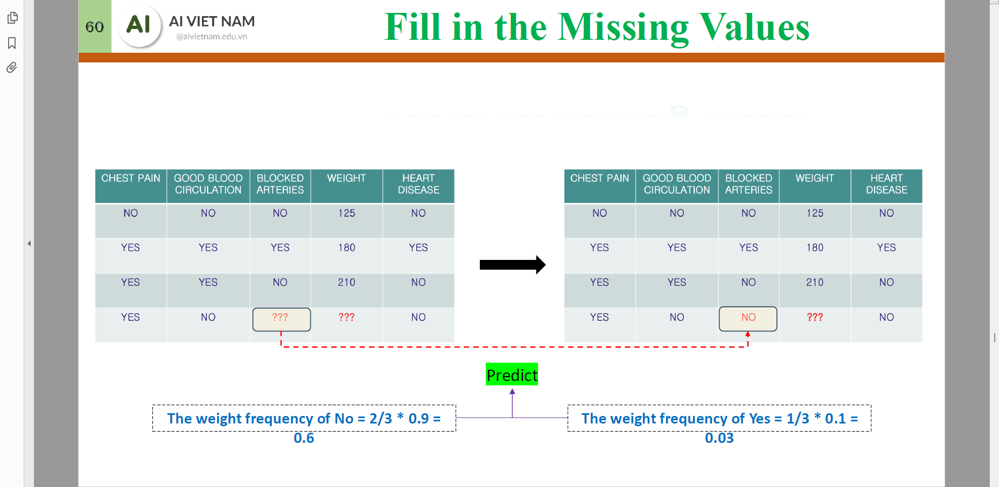
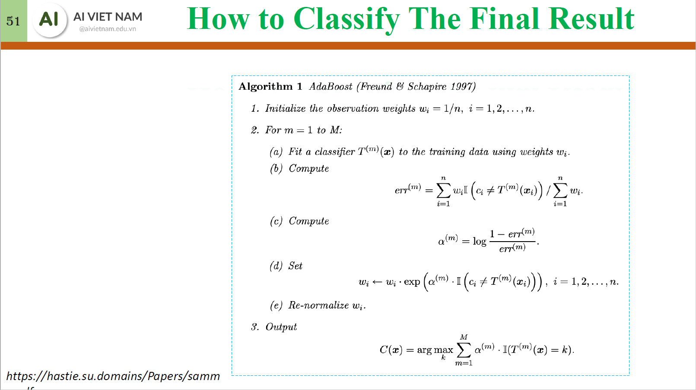
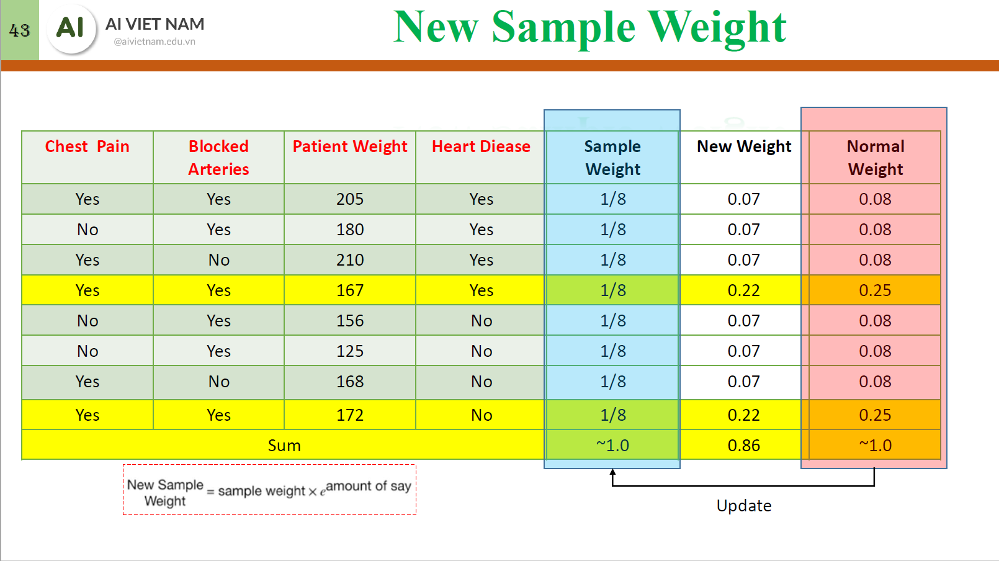

# Decision Tree
## Gini Impurity
$$\text{Gini}(D_i) = 1 - \sum_{j = 1}^{k} p_j^2$$
Minimize 
$$\text{Gini}(D) = \sum_i w_i\text{Gini}(D_i)$$
## Entropy & Information Gain
$$\text{Entropy}(D_i) = -\sum_{j = 1}^k p_j \log_2 p_j$$
Maximize
$$\text{Information Gain}(D) = \text{Entropy}(D) - \sum_i w_i\text{Entropy}(D_i)$$
## Classification for continious variables

## Pruning

Minimize "Tree Score" by pruning the depth.

# Ensemble Learning 
## Homogenous
### Bagging 

### Boosting

## Heterogenous
### Stacking

# Random Forest
## Flow
- For each **tree** in the **forest**
    - Create **bootstrapped** dataset: $N$ sampled datapoints (with replacement).
    - While there are columns left
        1. For each level of depth, choose 2 columns only to create tree.
        1. Choose the optimal column to create the first node and perform seggregation.
        1. Remove the column chosen.

## Fill missing data
1. Fill missing data with majority or mean.
    
1. Form **Proximity matrix** of $N\times N$ using Random Forest: in each iteration, calculate the number of samples clustered with the sample with missing data, without any awareness of the missing columns.
    
    

1. Normalize the **Proximity matrix** by the number of trees.
    
    
1. Re-fill the missing data with weighted value.
    
    
    
    

# AdaBoost

Create stumps $T^{(i)}$ (trees with depth of 1) that are weak classifiers. The next tree will focus on the misclassified data points $x_j$ of the previous tree by updating the probability to sample those points ($w_j$). The final prediction is a weighted sum of all the trees.
## Calculate $\text{Amount of Say}_{T^{(i)}}$
$$
\text{Amount of Say}_{T^{(i)}} = \dfrac{1}{2} \log \left( \frac{1 - \text{Error}_{T^{(i)}}}{\text{Error}_{T^{(i)}}} \right) = \dfrac{1}{2} \log \left(\text{Odds}_{T^{(i)}} \right)\\

$$
## Update the sampling probability $w_j$
### $y\in \{-1,1\}$
$$
w_j = \begin{cases}
    w_j \times \exp\left(\text{Amount of Say}_{T^{(i)}}\right) & \text{if } y_j \text{ is misclassified} \\
    w_j \times \exp\left(-\text{Amount of Say}_{T^{(i)}}\right) & \text{if } y_j \text{ is classified correctly}
\end{cases}
$$

### $y\in \{0,1\}$
$$
w_j = \begin{cases}
    w_j \times \exp\left(\text{Amount of Say}_{T^{(i)}}\right) & \text{if } y_j \text{ is misclassified} \\
    w_j  & \text{if } y_j \text{ is classified correctly}
\end{cases}
$$

## Normalize $w_j$ and resample data for the next stump

