# Linear Regression
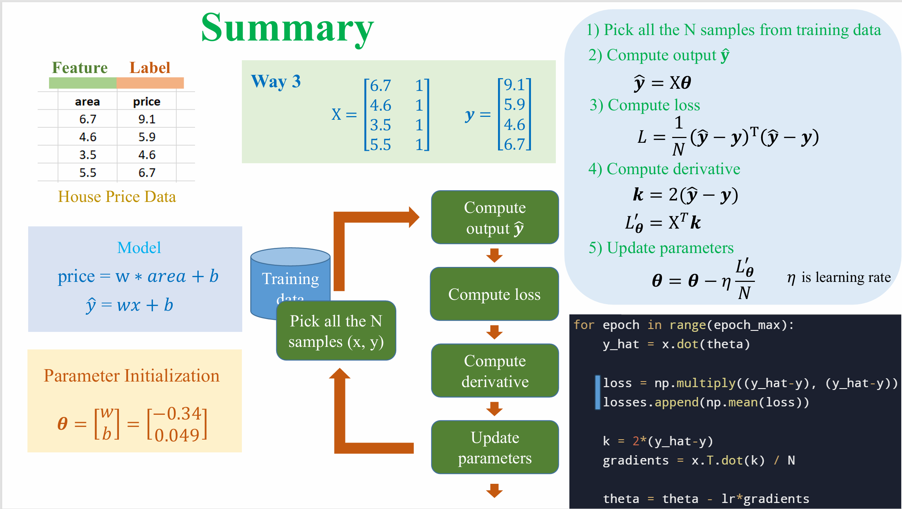
## Loss Functions
### Mean Squared Error (MSE)
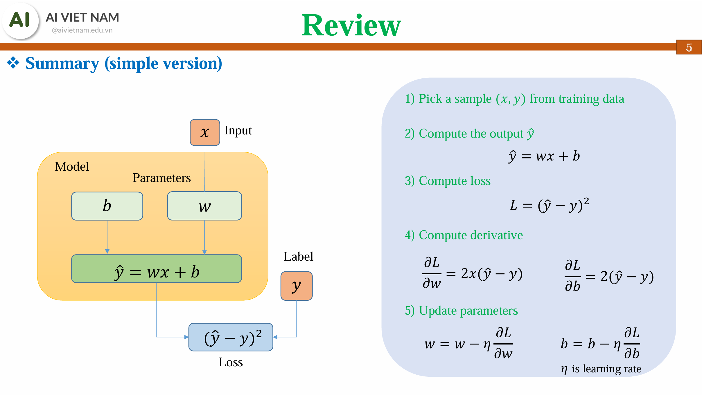
### Mean Absolute Error (MAE)
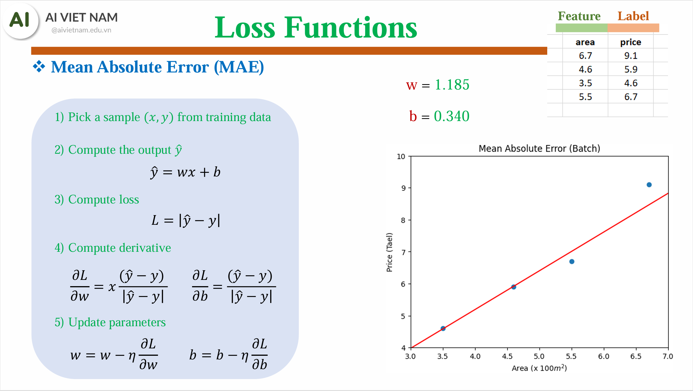
### Huber Loss
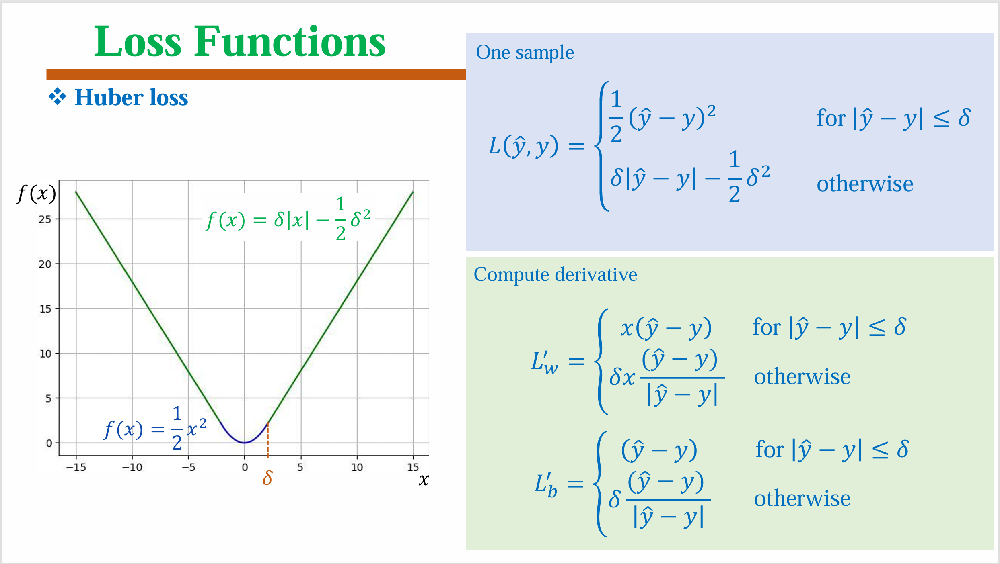

# Genetic Algorithm
[[Solution]_Simple_Genetic_Algorithm.ipynb]([Solution]_Simple_Genetic_Algorithm.ipynb)
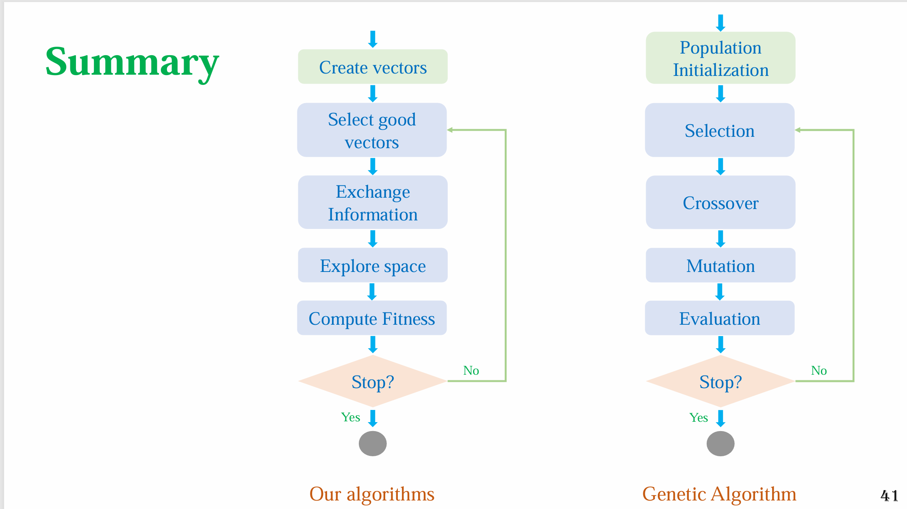
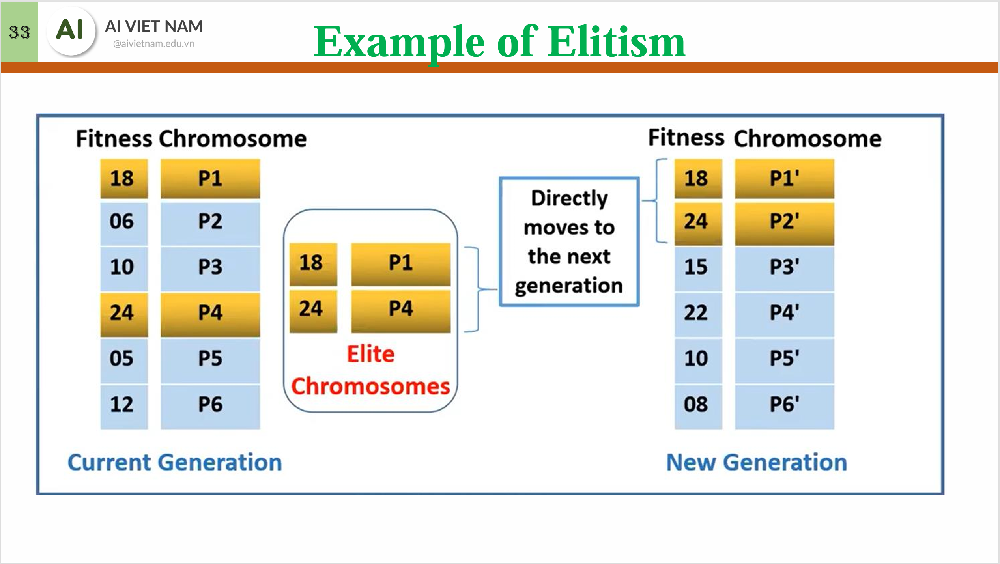
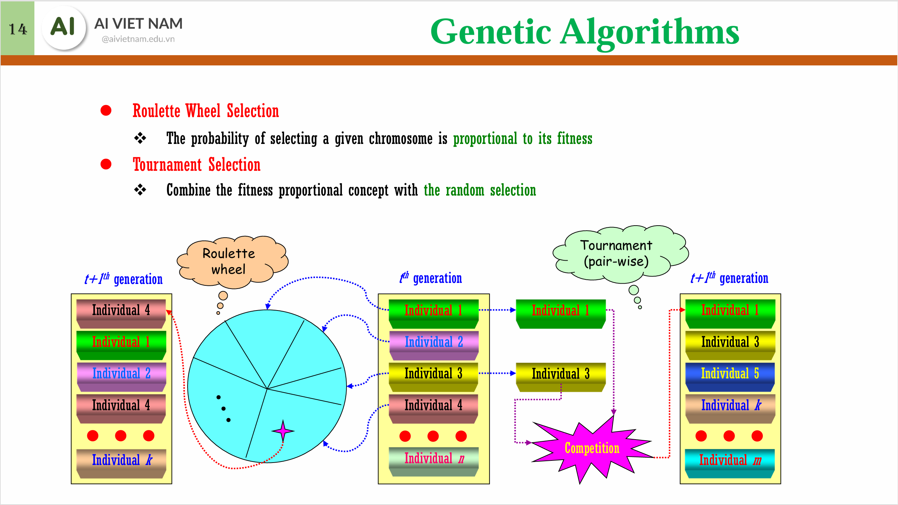
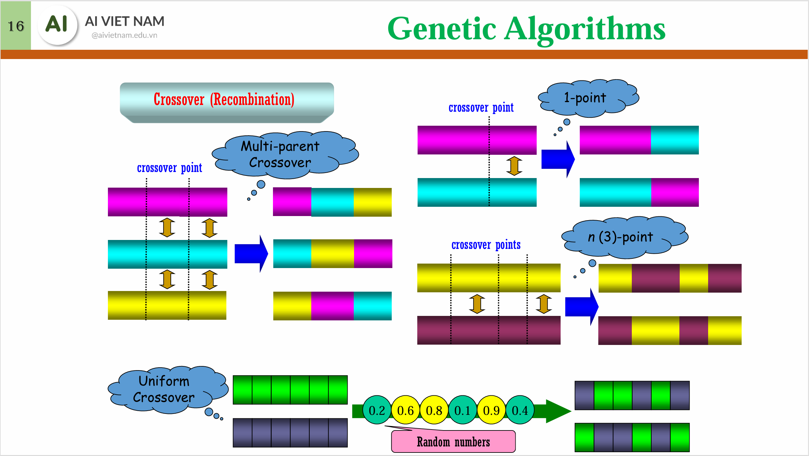
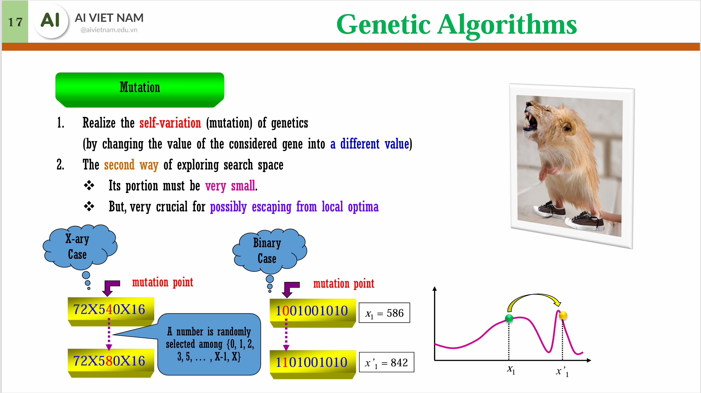

# Logistic Regression
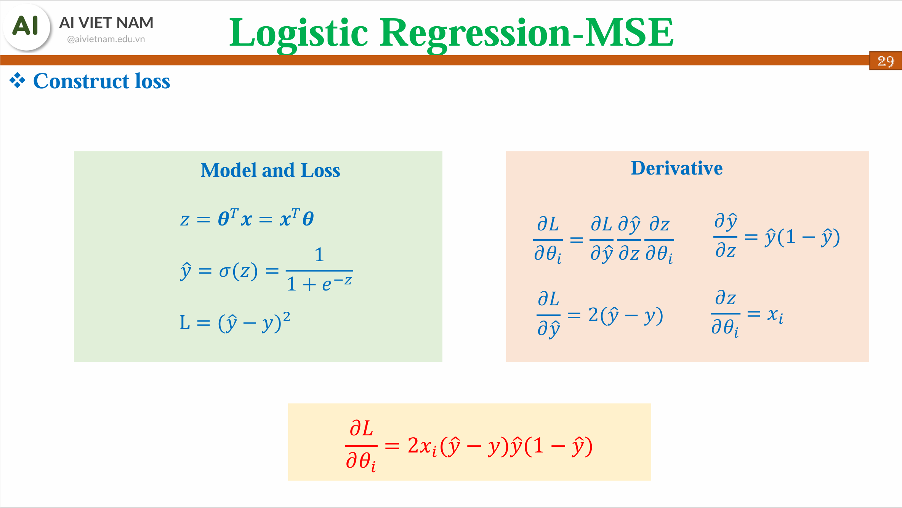
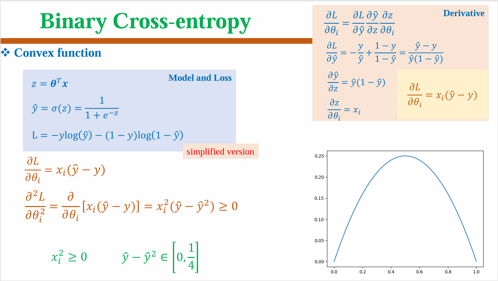
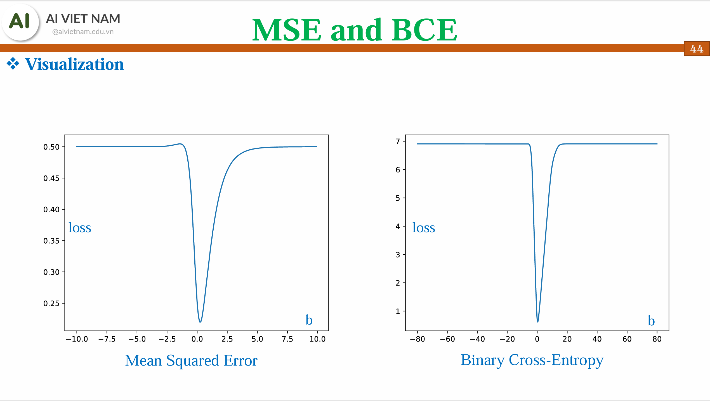
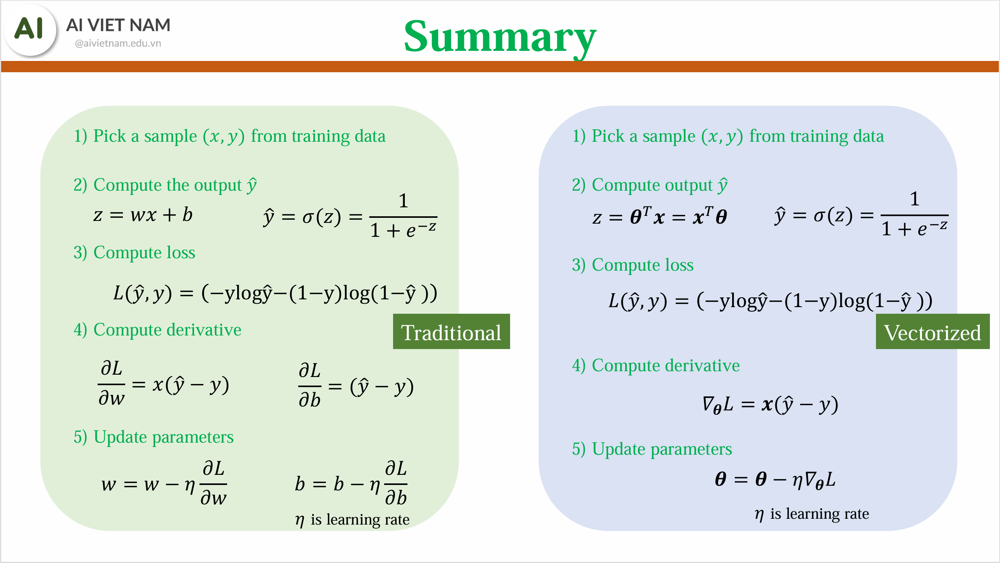

# Softmax Regression
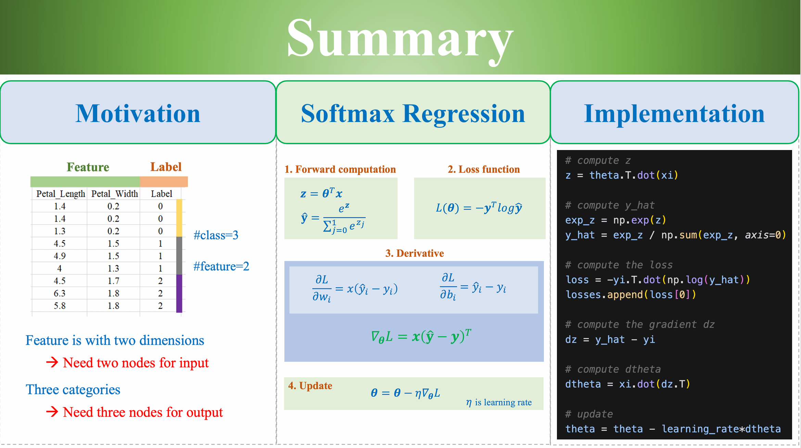


# Activation functions and Derivatives
## Summary
| Activation Function             | Formula                                                                                                | Derivative $f'(x)$                                                                                                                               |
| :------------------------------ | :----------------------------------------------------------------------------------------------------- | :----------------------------------------------------------------------------------------------------------------------------------------------- |
| **Sigmoid** | $\sigma(x) = \frac{1}{1 + e^{-x}}$                                                                          | $\sigma(x)(1 - \sigma(x))$                                                                                                                                 |
| **tanh** (Hyperbolic Tangent)   | $\tanh(x) = \frac{2}{1 + e^{-2x}} - 1 = \frac{e^x - e^{-x}}{e^x + e^{-x}}$                                   | $1 - \tanh^2(x)$                                                                                                                                     |
| **Softmax** | $\text{softmax}(x)_i = \dfrac{e^{x_i}}{\sum_{j=1}^{C} e^{x_j}}$                                                                                 | $\dfrac{d}{dx_j}\text{softmax(x)}_i=\begin{cases} \text{softmax(x)}_i(1-\text{softmax(x)}_i) & \text{if } i=j \\ -\text{softmax(x)}_i\cdot\text{softmax(x)}_j & \text{if } i \neq j \end{cases}$                                                                                                      |  
| **Softplus** | $f(x) = \log(1 + e^x)$                                                                                 | $\frac{1}{1 + e^{-x}}=\sigma(x)$                                                                                                       |
| **ReLU** (Rectified Linear Unit) | $f(x) = \begin{cases} 0 & \text{if } x < 0 \\ x & \text{if } x \ge 0 \end{cases}$                           | $f'(x) = \begin{cases} 0 & \text{if } x < 0 \\ 1 & \text{if } x > 0 \end{cases}$ (undefined at $x=0$)                                              |
| **ELU** (Exponential Linear Unit) | $f(x) = \begin{cases} \alpha(e^x - 1) & \text{if } x < 0 \\ x & \text{if } x \ge 0 \end{cases}$           | $f'(x) = \begin{cases} \alpha e^x & \text{if } x < 0 \\ 1 & \text{if } x > 0 \end{cases}$ (derivative is $\alpha$ at $x=0$ from left, $1$ from right) |
| **PReLU** (Parametric ReLU)     | $f(x) = \begin{cases} ax & \text{if } x < 0 \\ x & \text{if } x \ge 0 \end{cases}$                            | $f'(x) = \begin{cases} a & \text{if } x < 0 \\ 1 & \text{if } x > 0 \end{cases}$ (undefined at $x=0$)                                               |
| **SELU** (Scaled Exponential Linear Unit) | $f(x) = \begin{cases} \lambda x & \text{if } x \ge 0 \\ \lambda \alpha (e^x - 1) & \text{if } x < 0 \end{cases}$ <br> ($\lambda \approx 1.0507$, $\alpha \approx 1.6733$) | $f'(x) = \begin{cases} \lambda & \text{if } x > 0 \\ \lambda \alpha e^x & \text{if } x < 0 \end{cases}$                                                     |
| **Swish** (also SiLU - Sigmoid Linear Unit) | $\text{swish}(x) = x \cdot \frac{1}{1 + e^{-x}} = x \cdot \sigma(x)$                                          | $\sigma(x) + x \cdot \sigma(x)(1 - \sigma(x)) = \text{swish}(x) + \sigma(x)(1-\text{swish}(x))$                                       |
| **GELU** (Gaussian Error Linear Unit) | Approx: $f(x) \approx x \cdot \sigma(1.702x)$ <br> Exact: $f(x) = x \Phi(x) = xP(X \leq x \| X \sim \mathcal{N}(0, 1))$                      | Approx: $\sigma(1.702x) + 1.702x \cdot \sigma(1.702x)(1 - \sigma(1.702x))$ <br> Exact: $\Phi(x) + x\phi(x)$ where $\phi(x)$ is the PDF of std. normal dist. |
## Remark for the derivative of Cross-Entropy Loss with Softmax
Let
```math
\begin{align*}
\text{CE\_Loss}(y,\hat{y}) &= \mathcal{L}(y, \hat{y})\\
&\coloneqq -\sum_{i=1}^{C} y_i \log(\hat{y}_i)\\
&= -\sum_{i=1}^{C} y_i \log(\text{softmax}(z_i))\\
&= -\sum_{i=1}^{C} y_i \log\left(\frac{e^{z_i}}{\sum_{j=1}^{C} e^{z_j}}\right)\\
\end{align*}
```
We have
```math
\begin{align*}
\dfrac{d\mathcal{L}}{dz_i}
&= -\sum_{j=1}^{C} \left(\dfrac{d\mathcal{L}}{d\hat{y}_jj} \cdot \dfrac{d\hat{y}_j}{dz_i}\right)\\
&= \left(\dfrac{d\mathcal{L}}{d\hat{y}_i} \cdot \dfrac{d\hat{y}_i}{dz_i}\right)+\sum_{j\neq i}\left(\dfrac{d\mathcal{L}}{d\hat{y}_j} \cdot \dfrac{d\hat{y}_jj}{dz_i}\right)\\
&= -\left(\dfrac{y_i}{\hat{y}_i}\cdot\left({\hat{y}_i}(1-\hat{y}_i)\right) - \sum_{j\neq i}\dfrac{y_j}{\hat{y}_jj}\cdot\left({\hat{y}_i}\hat{y}_j\right)\right)\\
&= -y_i + y_i\hat{y}_i+\hat{y}_i\sum_{j\neq i}\hat{y}_j  \\
&= -y_i + \hat{y}_i\sum_{j=1}^{C}\hat{y}_j\\
&= -y_i + \hat{y}_i\cdot 1\\
&=  \hat{y}_i -y_i\\
\Rightarrow \dfrac{d\mathcal{L}}{dz} &= \hat{y} - y
\end{align*}
```

# Initializers
## Expectation and Variance Review
```math
\begin{align*}
\mathbb{E}(\sum_{i=1}^{n}\alpha_iX_i) &= \sum_{i=1}^{n}\alpha_i\mathbb{E}(X_i)\\ \hline
\operatorname{Cov}(X,Y) &= \mathbb{E}(XY) - \mathbb{E}(X)\mathbb{E}(Y)\\
\operatorname{Var}(\sum_{i=1}^{n}\alpha_iX_i) &= \sum_{i=1}^{n}\sum_{j=1}^{n}\operatorname{Cov}(\alpha_iX_i, \alpha_jX_j)\\
    \Rightarrow \operatorname{Var}(\alpha X+\beta Y) &= \operatorname{Cov}(\alpha X, \alpha X) + \operatorname{Cov}(\beta Y, \beta Y) + 2\operatorname{Cov}(\alpha X, \beta Y)\\
    &= \operatorname{Var}(\alpha X) + \operatorname{Var}(\beta Y) + 2\operatorname{Cov}(\alpha X, \beta Y)\\
    &= \alpha^2 \operatorname{Var}(X) + \beta^2 \operatorname{Var}(Y) + 2\alpha\beta \operatorname{Cov}(X, Y)\\ \hline
\mathbb{E}(\prod_{i=1}^{n}X_i) &= \prod_{i=1}^{n}\mathbb{E}(X_i) \text{ (if $X_i$ are independent)}\\ \hline
\operatorname{Var}(XY) &= \mathbb{E}(X^2Y^2) - [\mathbb{E}(XY)]^2 \\
&= \operatorname{Cov}(X^2, Y^2) + \mathbb{E}(X^2)\mathbb{E}(Y^2) - [\mathbb{E}(XY)]^2 \\
&= \operatorname{Cov}(X^2, Y^2) + (\operatorname{Var}(X) + [\mathbb{E}(X)]^2)(\operatorname{Var}(Y) + [\mathbb{E}(Y)]^2) \\
&\phantom{=}- [\operatorname{Cov}(X, Y) + \mathbb{E}(X)\mathbb{E}(Y)]^2\\
\Rightarrow \operatorname{Var}(XY) &= \operatorname{Var}(X)\operatorname{Var}(Y)+[\mathbb{E}(X)]^2\operatorname{Var}(Y)+[\mathbb{E}(Y)]^2\operatorname{Var}(X) \text{ (if $X, Y$ are independent)}
\end{align*}
```
## Assumptions
In an MLP, at layer $l$ 
$$
a^{(l+1)} = f(z^{(l+1)}) = f(a^{(l)}{W^{(l)}}^T)
$$
where $f$ is the activation function and $W^{(l)}$ of shape $(n_{out}, n_{in})$ is the weight matrix of layer $l$.  

In order to avoid vanishing or exploding gradients, we need to ensure that the variance of the activations is preserved across layers, or $\operatorname{Var}(a_l)=\operatorname{Var}(a^{(l+1)})$.  
For analysis simplification, we also require that the weights are initialized with zero mean, i.e., $\mathbb{E}(W^{(l)})=0$.


## Xavier Glorot Initialization
### Formulae
This applies to activation functions like **tanh** and **sigmoid**, which are symmetric around zero, i.e., $\mathbb{E}(a^{(l+1)})=\mathbb{E}(a^{(l)})=0$.
| Activation Function | Uniform Distribution ($W \sim \mathcal{U}(-r, r)$) | Normal Distribution ($W \sim \mathcal{N}(0, \sigma^2)$) |
|---------------------|----------------------------------------------------|--------------------------------------------------------|
| **tanh**            | $r = \sqrt{\dfrac{6}{n_{in} + n_{out}}}=\dfrac{\sqrt{3}}{\sqrt{n}}$            | $\sigma^2 = \dfrac{2}{n_{in} + n_{out}}=\dfrac{1}{n}$                |
| **sigmoid**         | $r = \sqrt{\dfrac{96}{n_{in} + n_{out}}}=\dfrac{4\sqrt{3}}{\sqrt{n}}$            | $\sigma^2 = \dfrac{32}{n_{in} + n_{out}}=\dfrac{16}{n}$                |
### (TODO) Proof (optional)

## Kaiming He Initialization
### Formulae
| Activation Function | Uniform Distribution ($W \sim \mathcal{U}(-r, r)$) | Normal Distribution ($W \sim \mathcal{N}(0, \sigma^2)$) |
|---------------------|----------------------------------------------------|--------------------------------------------------------|
| **ReLU**            | $r = \dfrac{\sqrt{6}}{\sqrt{n_{in\|out}}}$            | $\sigma^2 = \dfrac{2}{n_{in\|out}}$                |

### (TODO) Proof (optional)


# Optimizers
Discussed optimizers:
- SGD
- SGD with momentum
- AdaGrad: use the cumulative sum of squared gradients to scale down the learning rate
- RMSProp: use the exponentially weighted average of squared gradients (called *variance*) to normalize the gradient
- Adam: combines ideas from RMSProp and momentum
- AdamW: decouples weight decay from the optimization step $(\underbrace{\theta_t=\theta_{t-1}-\eta\frac{m_t}{\sqrt{v_t}+\epsilon}}_{\text{Adam}}-\eta\theta_{t-1})$

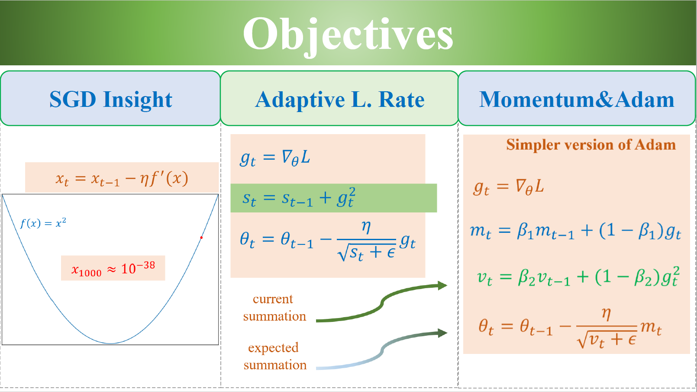
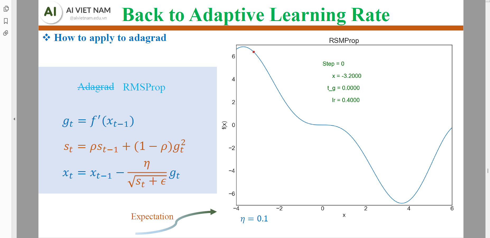
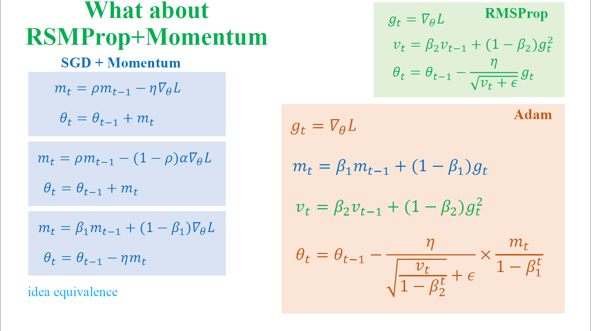
