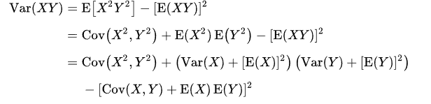

# Linear Regression

## Loss Functions
### Mean Squared Error (MSE)

### Mean Absolute Error (MAE)

### Huber Loss


# Genetic Algorithm
[[Solution]_Simple_Genetic_Algorithm.ipynb]([Solution]_Simple_Genetic_Algorithm.ipynb)


# Logistic Regression


# Softmax Regression


# Initializers
## Expectation and Variance
```math
\mathbb{E}(\sum_{i=1}^{n}X_i) = \sum_{i=1}^{n}\mathbb{E}(X_i)\\
Var(\sum_{i=1}^{n}X_i) = \sum_{i=1}^{n}\sum_{j=1}^{n}Cov(X_i, X_j) \Rightarrow
```
<!-- TODO -->


# Optimizers


