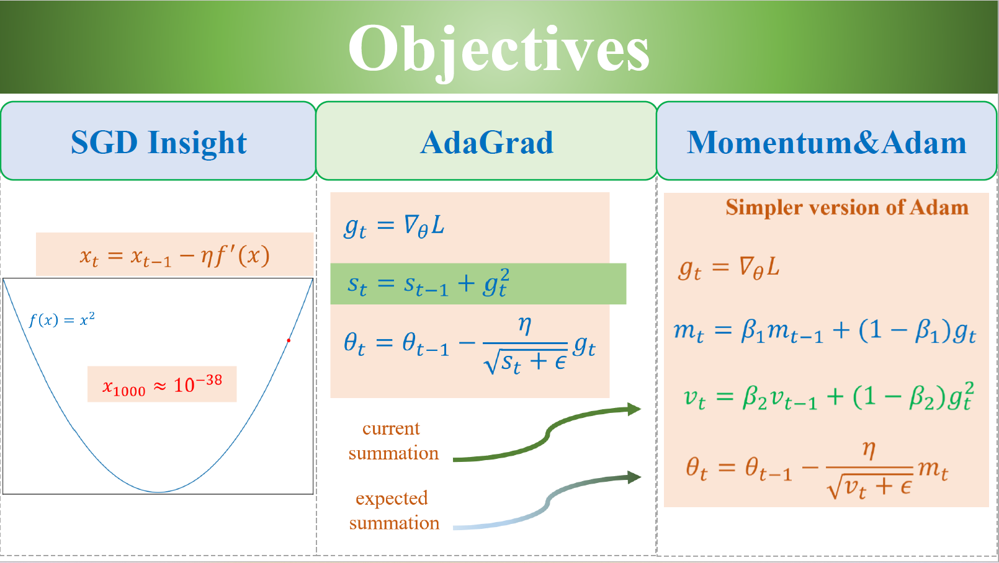
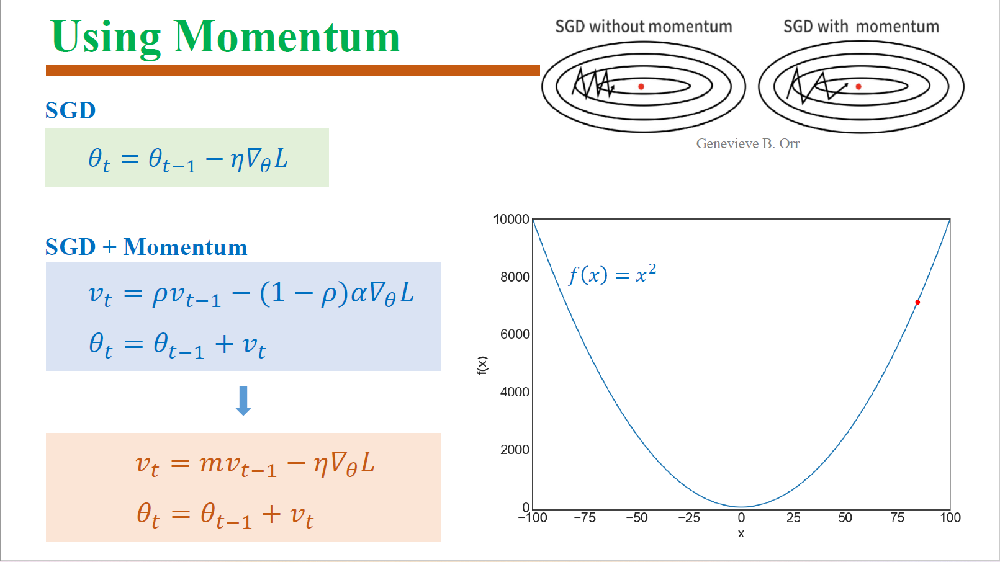

# Linear Regression

## Loss Functions
### Mean Squared Error (MSE)

### Mean Absolute Error (MAE)

### Huber Loss


# Genetic Algorithm
[[Solution]_Simple_Genetic_Algorithm.ipynb]([Solution]_Simple_Genetic_Algorithm.ipynb)


# Logistic Regression


# Softmax Regression


# Initializers
## Expectation and Variance Review
```math
\begin{align*}
\mathbb{E}(\sum_{i=1}^{n}\alpha_iX_i) &= \sum_{i=1}^{n}\alpha_i\mathbb{E}(X_i)\\ \hline
\operatorname{Cov}(X,Y) &= \mathbb{E}(XY) - \mathbb{E}(X)\mathbb{E}(Y)\\
\operatorname{Var}(\sum_{i=1}^{n}\alpha_iX_i) &= \sum_{i=1}^{n}\sum_{j=1}^{n}\operatorname{Cov}(\alpha_iX_i, \alpha_jX_j)\\
    \Rightarrow \operatorname{Var}(\alpha X+\beta Y) &= \operatorname{Cov}(\alpha X, \alpha X) + \operatorname{Cov}(\beta Y, \beta Y) + 2\operatorname{Cov}(\alpha X, \beta Y)\\
    &= \operatorname{Var}(\alpha X) + \operatorname{Var}(\beta Y) + 2\operatorname{Cov}(\alpha X, \beta Y)\\
    &= \alpha^2 \operatorname{Var}(X) + \beta^2 \operatorname{Var}(Y) + 2\alpha\beta \operatorname{Cov}(X, Y)\\ \hline
\mathbb{E}(\prod_{i=1}^{n}X_i) &= \prod_{i=1}^{n}\mathbb{E}(X_i) \text{ (if $X_i$ are independent)}\\ \hline
\operatorname{Var}(XY) &= \mathbb{E}(X^2Y^2) - [\mathbb{E}(XY)]^2 \\
&= \operatorname{Cov}(X^2, Y^2) + \mathbb{E}(X^2)\mathbb{E}(Y^2) - [\mathbb{E}(XY)]^2 \\
&= \operatorname{Cov}(X^2, Y^2) + (\operatorname{Var}(X) + [\mathbb{E}(X)]^2)(\operatorname{Var}(Y) + [\mathbb{E}(Y)]^2) \\
&\phantom{=}- [\operatorname{Cov}(X, Y) + \mathbb{E}(X)\mathbb{E}(Y)]^2\\
\Rightarrow \operatorname{Var}(XY) &= \operatorname{Var}(X)\operatorname{Var}(Y)+[\mathbb{E}(X)]^2\operatorname{Var}(Y)+[\mathbb{E}(Y)]^2\operatorname{Var}(X) \text{ (if $X, Y$ are independent)}
\end{align*}
```
## Assumptions
In an MLP, at layer $l$ 
$$
a_{l+1} = f(z_{l+1}) = f(a_{l}W_{l}^T)
$$
where $f$ is the activation function and $W_{l}$ of shape $(n_{out}, n_{in})$ is the weight matrix of layer $l$.  

In order to avoid vanishing or exploding gradients, we need to ensure that the variance of the activations is preserved across layers, or $\operatorname{Var}(a_l)=\operatorname{Var}(a_{l+1})$.  
For analysis simplification, we also require that the weights are initialized with zero mean, i.e., $\mathbb{E}(W_{l})=0$.


## Xavier Glorot Initialization
### Formulae
This applies to activation functions like **tanh** and **sigmoid**, which are symmetric around zero, i.e., $\mathbb{E}(a_{l+1})=\mathbb{E}(a_{l})=0$.
| Activation Function | Uniform Distribution ($W \sim \mathcal{U}(-r, r)$) | Normal Distribution ($W \sim \mathcal{N}(0, \sigma^2)$) |
|---------------------|----------------------------------------------------|--------------------------------------------------------|
| **tanh**            | $r = \sqrt{\dfrac{6}{n_{in} + n_{out}}}=\dfrac{\sqrt{3}}{\sqrt{n}}$            | $\sigma^2 = \dfrac{2}{n_{in} + n_{out}}=\dfrac{1}{n}$                |
| **sigmoid**         | $r = \sqrt{\dfrac{96}{n_{in} + n_{out}}}=\dfrac{4\sqrt{3}}{\sqrt{n}}$            | $\sigma^2 = \dfrac{32}{n_{in} + n_{out}}=\dfrac{16}{n}$                |
### (TODO) Proof (optional)

## Kaiming He Initialization
### Formulae
| Activation Function | Uniform Distribution ($W \sim \mathcal{U}(-r, r)$) | Normal Distribution ($W \sim \mathcal{N}(0, \sigma^2)$) |
|---------------------|----------------------------------------------------|--------------------------------------------------------|
| **ReLU**            | $r = \dfrac{\sqrt{6}}{\sqrt{n_{in\|out}}}$            | $\sigma^2 = \dfrac{2}{n_{in\|out}}$                |

### (TODO) Proof (optional)


# Optimizers
Discussed optimizers:
- SGD
- SGD with momentum
- AdaGrad: use the cumulative sum of squared gradients to scale down the learning rate
- RMSProp: use the exponentially weighted average of squared gradients (called *variance*) to normalize the gradient
- Adam: combines ideas from RMSProp and momentum
- AdamW: decouples weight decay from the optimization step $(\underbrace{\theta_t=\theta_{t-1}-\eta\frac{m_t}{\sqrt{v_t}+\epsilon}}_{\text{Adam}}-\eta\theta_{t-1})$




