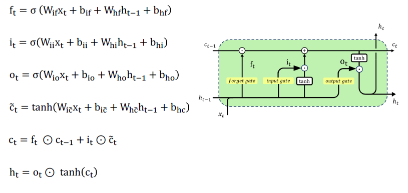

- [CNN](https://docs.pytorch.org/docs/stable/generated/torch.nn.Conv2d.html):
    ```math
    \text{Output size} = \left\lfloor \frac{\text{Input size} - \text{Kernel size} + 2 \times \text{Padding}}{\text{Stride}} \right\rfloor + 1
    ```
    ```math
    \Rightarrow \text{padding="same"} \Leftrightarrow k=2p+1
    ```

- [RNN](https://docs.pytorch.org/docs/stable/generated/torch.nn.RNN.html):
    ```math
    h_t=\tanh(x_tW_{ih}^T+b_{ih}+h_{t-1}W_{hh}^T+b_{hh})
    ```
    where 
    > $x$ of $(L, H_{in})$ </br>
    > $W_{ih}$ of $(H, H_{in})$ </br>
    > $W_{hh}$ of $(H, H)$ </br>
    > $b_{ih}, b_{hh}$ of $(H)$
- [LSTM](https://docs.pytorch.org/docs/stable/generated/torch.nn.LSTM.html):
    
- [Attention](https://docs.pytorch.org/docs/stable/generated/torch.nn.MultiheadAttention.html):
    > Attention = $\text{softmax}(\dfrac{QK^T}{\sqrt{d}})*V$
    