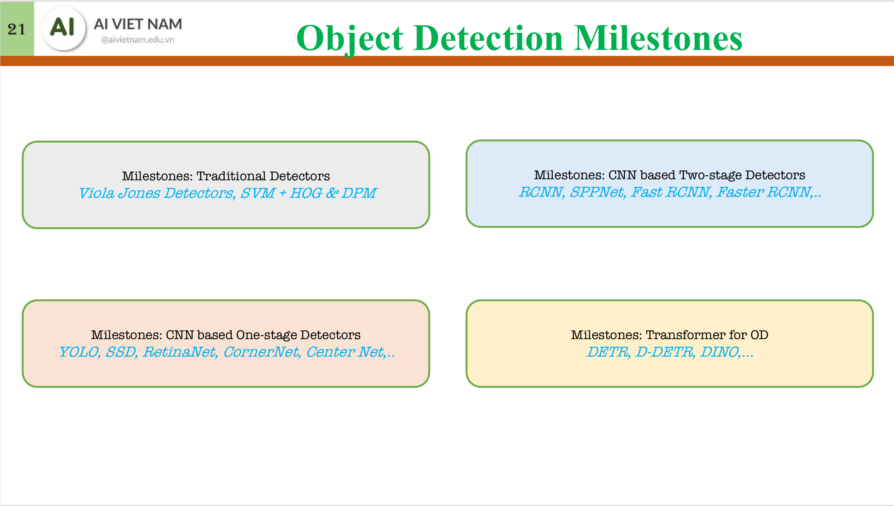
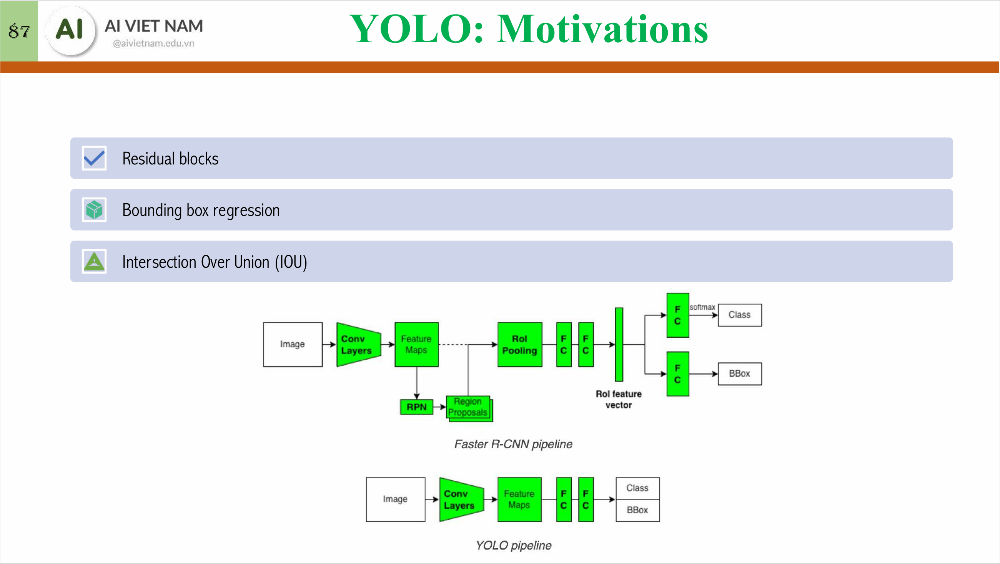
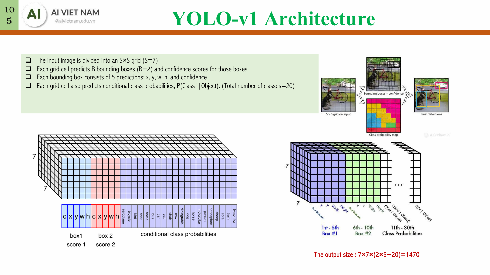
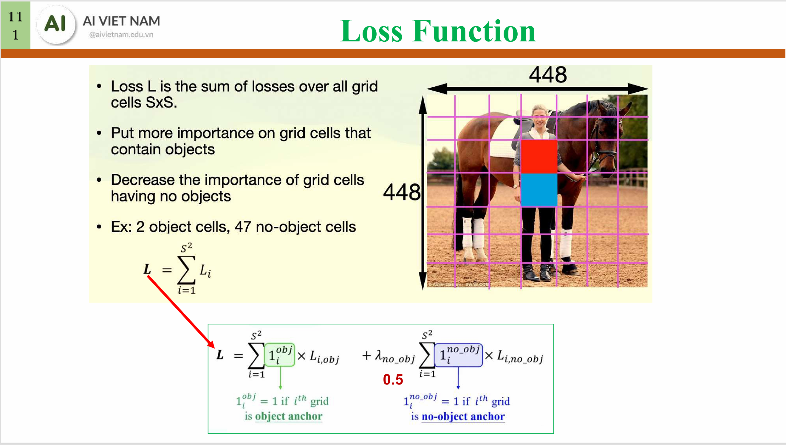
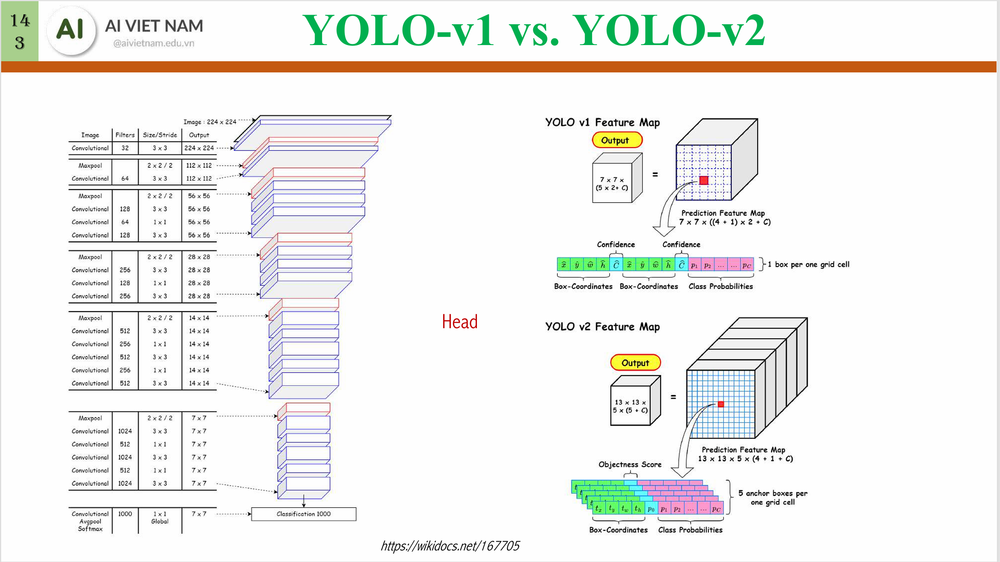
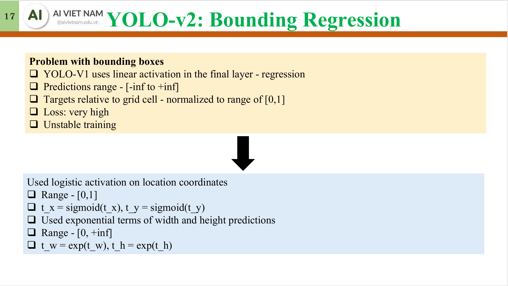
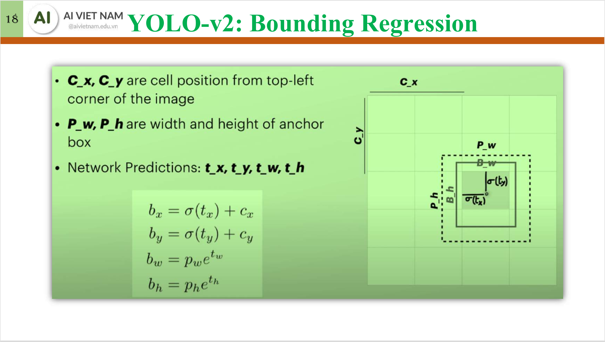
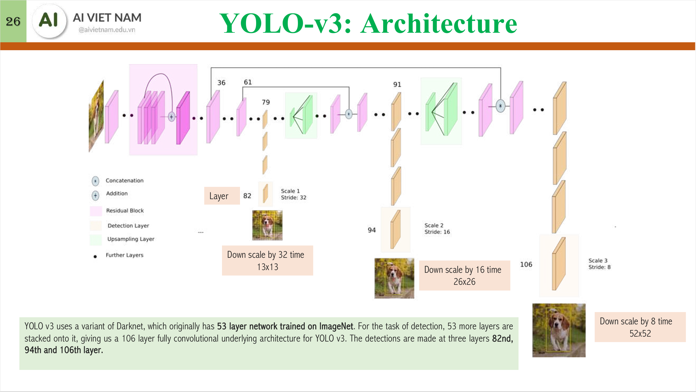

# Transfer Learning

# Knowledge distillation

# Object detection

## Non Maximal Suppression (NMS)

## With CNN

## R-CNN and Fast R-CNN

## With YOLOs

### YOLO-v1
**Architecture**: divides image into 7×7 grid, each cell predicts 2 boxes + 20 classes → 1470 output vector.

**Loss function**: 
Loss = bbox regression + object confidence + class prediction (with weighted terms).

### YOLO-v2
**Architecture**: adds anchor boxes, removes FC layers, uses lighter backbone (Darknet-19).

**Loss function**: same as YOLO-v1, but with additional terms for bounding box regression

### YOLO-v3
**Architecture**: adds SPP (Spatial Pyramid Pooling) module, uses Darknet-53 backbone.

## With Transformers

# Mixture of Experts (MoE)

# NLP preprocessing
## Preprocessing 
(TODO): clean up code
[Tokenization_and_Embedding.ipynb](Tokenization_and_Embedding.ipynb)
[Tokenizer playground](https://xenova-the-tokenizer-playground.static.hf.space/index.html)
[Tokenization in Hugging Face](https://huggingface.co/docs/transformers/fast_tokenizers)

## Stemming and lemmatization (optional)
- Stemming: reduces words to their root form (e.g., "running" to "run")
- Lemmatization: reduces words to their base form (e.g., "better" to "good")

# Part-of-Speech (POS) tagging

# Named Entity Recognition (NER)

# Aspect-based Sentiment Analysis

# BERTs

# Text generation

# Machine Translation

# Question Answering (QA)

## By classification

## By extraction

## By generation

# KAN

# Counting with YOLO

# Face detection and identification