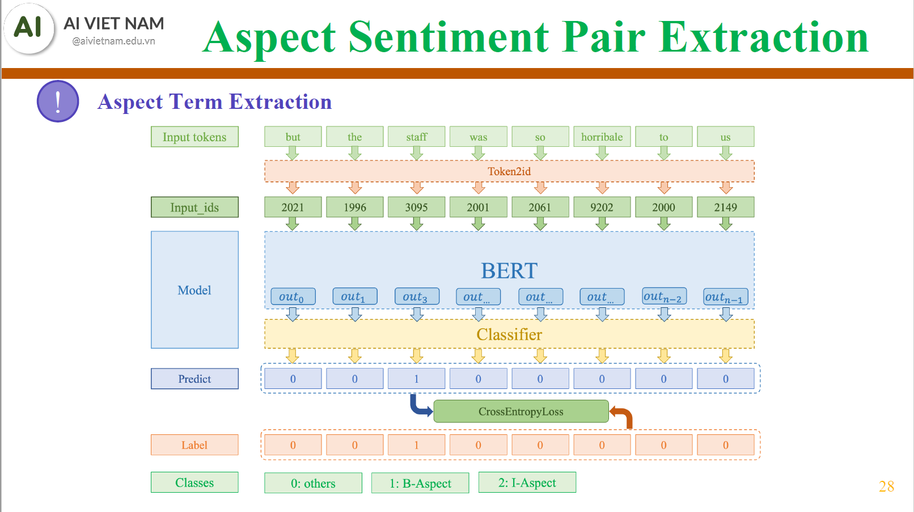

# Transfer Learning

# Knowledge distillation

# Object detection

# YOLOs

# Mixture of Experts (MoE)

# NLP preprocessing
## Preprocessing 
(TODO): clean up code
[Tokenization_and_Embedding.ipynb](Tokenization_and_Embedding.ipynb)
[Tokenizer playground](https://xenova-the-tokenizer-playground.static.hf.space/index.html)
[Tokenization in Hugging Face](https://huggingface.co/docs/transformers/fast_tokenizers)

## Stemming and lemmatization (optional)
- Stemming: reduces words to their root form (e.g., "running" to "run")
- Lemmatization: reduces words to their base form (e.g., "better" to "good")

# Part-of-Speech (POS) tagging

# Named Entity Recognition (NER)

# Aspect extraction

# BERTs

# Text generation

# Machine Translation

# KAN

# Counting with YOLO

# Face detection and identification