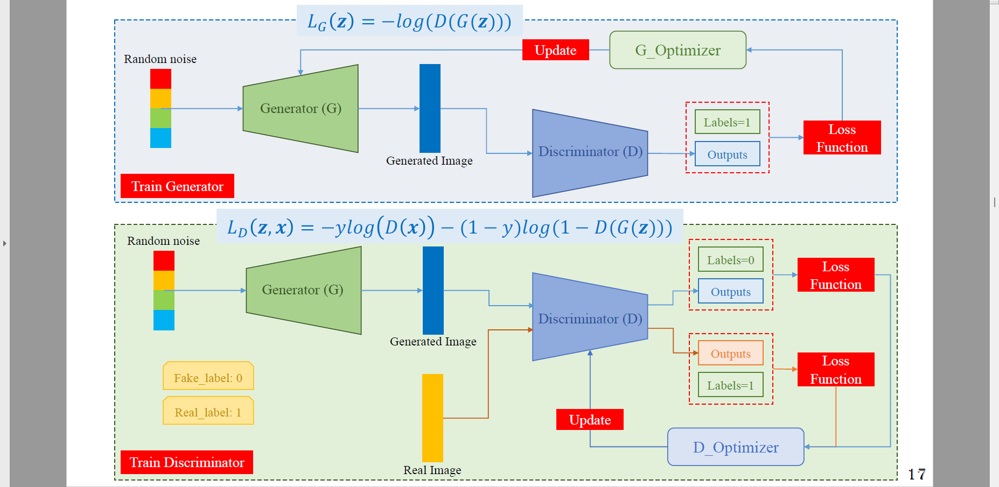
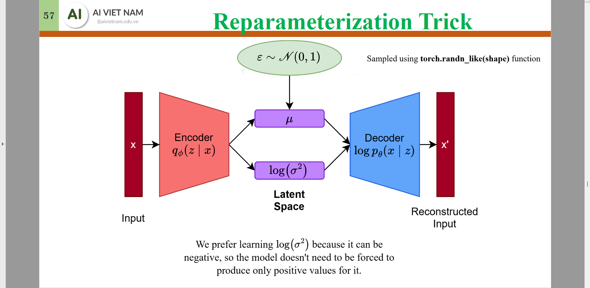
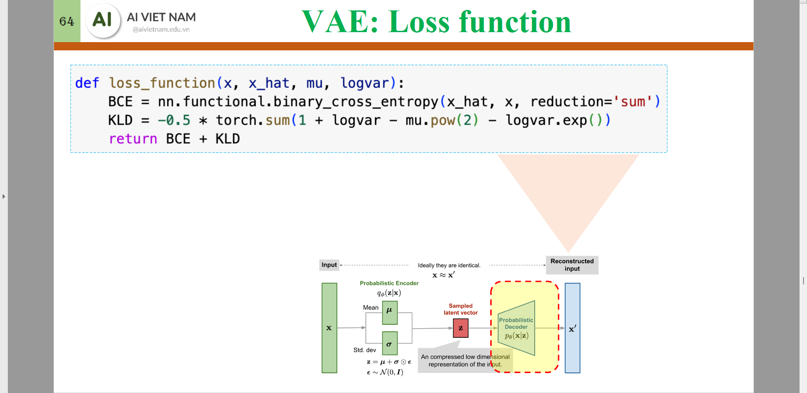
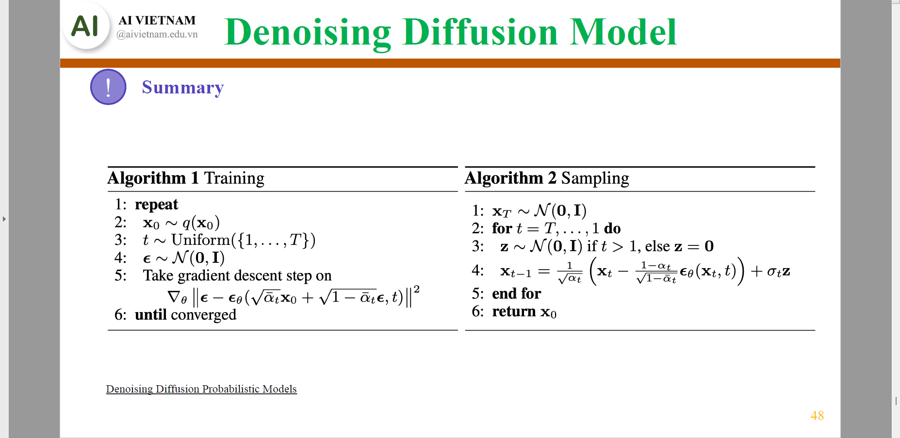
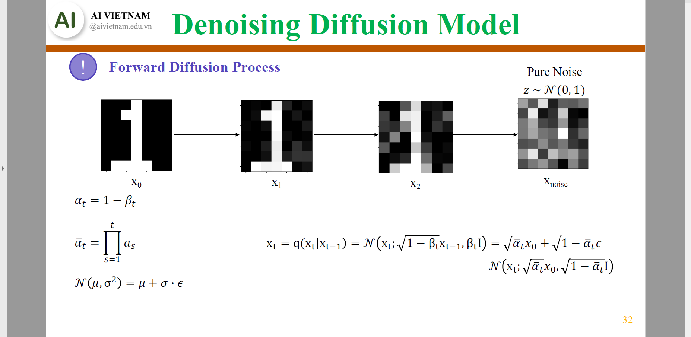

# Style transfer

## Gram Matrix
```math
\text{Gram}(X) = \text{flatten}(X).\text{flatten}(X)^T
```
where 
* $X$ of $(B,C,H,W)$
* $\text{flatten}(X)$ of $(B,C,H*W)$
* $\text{Gram}(X)$ of $(B,C,C)$

This removes the spatial information, which aligns with the definition of "style".

## Loss
```math
L(\text{output}, \text{content}, \text{style}) =\lambda_\text{content}\times\underbrace{L_\text{content}}_{\text{MSE}(\text{output},\text{content})} + \lambda_\text{style}\times\underbrace{L_\text{style}}_{\text{MSE}(\text{Gram}(\text{Output}),\text{Gram}(\text{style})) }
```

# GAN (Generative Adversarial Network)

## Loss
```math
\begin{align*}
L_G(z) &= -\log(D(G(z)))\\
L_D(z,x) &= -y\log(D(x)) - (1-y)\log(1-D(G(z)))
\end{align*}
```

## Transposed Convolution 2D (`ConvTranspose2d`)
See [ConvTranspose2d](https://docs.pytorch.org/docs/stable/generated/torch.nn.ConvTranspose2d.html)
```math
H_{out} = W_{out} 
= (H_{in}−1)\times stride−2\times padding+dilation\times(kernel\_size−1)+output\_padding+1
```


# VAE (Variational AutoEncoder)

where $p_\theta(x|z)$ is the *true* posterior and $q_\phi(z|x)$ is the *approximated* prior.

## Loss function
### General form
```math
\mathcal{L}(\theta, \phi; x) = -\underbrace{\mathbb{E}_{q_\phi(z|x)}[\log p_\theta(x|z)]}_{\text{Reconstruction loss}} + \underbrace{D_{KL}(q_\phi(z|x) \| p(z))}_{\text{Regularization term}}
```
where:
- $q_\phi(z|x)$ is the encoder (inference model) that approximates the **true posterior**.
- $p_\theta(x|z)$ is the decoder (generative model) that generates the data from the latent space.
- $p(z)$: is the **prior distribution**, typically a standard normal distribution $\mathcal{N}(0, I)$.

### Example of loss function for MNIST dataset

```math
\begin{align*}
L 
&= \text{BCE}(x, \hat{x}) + \text{KL}(x, \hat{x}) \\
&= \text{BCE}(x,\hat{x}) - \dfrac{1}{2}\sum(1+\text{logvar}-\mu^2-\exp(\text{logvar}))
\end{align*}
```
Here, as an example, $\text{BCE}$ is used as the reconstruction loss for single channel images.
### Proof of the equivalence of KL divergence in the previous example (optional)
Let $P(z)=N(\mu,\Sigma^2)$ and $Q(z)=N(0,1)$ with $\Sigma$ being a diagonal covariance matrix. Therefore, the *pdf*s of $P$ and $Q$ are respectively:
```math
\begin{align*}
p(z) &= \frac{1}{\sqrt{(2\pi)^D |\Sigma|}} \exp\left(-\frac{1}{2}(z-\mu)^T \Sigma^{-1} (z-\mu)\right)\\
    &= (2\pi)^{-D/2} \left(\prod_{i=1}^D \sigma_i^2\right)^{-1/2} \exp\left(-\frac{1}{2}\sum_{i=1}^D \frac{(z_i - \mu_i)^2}{\sigma_i^2}\right)\\
q(z) &= \frac{1}{\sqrt{(2\pi)^D |I|}} \exp\left(-\frac{1}{2}z^T z\right) = (2\pi)^{-D/2} \exp\left(-\frac{1}{2}\sum_{i=1}^D z_i^2\right)
\end{align*}
```
We have
```math
\begin{align*}
\text{KL}(p\|q) &=\int{p(z)\log\dfrac{p(z)}{q(z)}}dz\\
&=\int{p(z)\left(\underbrace{\log{p(z)}}_{-\frac{D}{2}\log(2\pi) - \frac{1}{2}\sum_{i=1}^D \log(\sigma_i^2) - \frac{1}{2}\sum_{i=1}^D \frac{(z_i - \mu_i)^2}{\sigma_i^2}}-\underbrace{\log{q(z)}}_{-\frac{D}{2}\log(2\pi) - \frac{1}{2}\sum_{i=1}^D z_i^2}\right)}dz\\
&= \int{p(z)\left(-\frac{1}{2}\sum_{i=1}^D \left(\log(\sigma_i^2) + \frac{(z_i - \mu_i)^2}{\sigma_i^2} - z_i^2\right)\right)}dz\\
\end{align*}
```
Because the dimensions are assumed to be independent (diagonal covariance matrix), we can evaluate the expectation for each dimension $i$ separately.
```math
E_{p(z)}\left[\log(\sigma_i^2) + \frac{(z_i - \mu_i)^2}{\sigma_i^2} - z_i^2\right] = E_{p(z)}[\log(\sigma_i^2)] + E_{p(z)}\left[\frac{(z_i - \mu_i)^2}{\sigma_i^2}\right] - E_{p(z)}[z_i^2]
```
$E_{p(z)}[\log(\sigma_i^2)]$ is simply $\log(\sigma_i^2)$ since it's a constant with respect to $z$.  
$E_{p(z)}[(z_i - \mu_i)^2]$ is the variance of $z_i$ under $p(z)$, which is $\sigma_i^2$. So, $E_{p(z)}\left[\frac{(z_i - \mu_i)^2}{\sigma_i^2}\right] = \frac{\sigma_i^2}{\sigma_i^2} = 1$.  
$E_{p(z)}[z_i^2]=\sigma_i^2+(E_{p(z)}[z_i])^2 = \sigma_i^2 + \mu_i^2$, since $\text{var}(x)=E(x^2)-(E(x))^2$.

Substituting these expected values back:
```math
\begin{align*}
E_{p(z)}\left[\log(\sigma_i^2) + \frac{(z_i - \mu_i)^2}{\sigma_i^2} - z_i^2\right] &= \log(\sigma_i^2) + 1 - (\sigma_i^2 + \mu_i^2)\\
&= \log(\sigma_i^2) + 1 - \sigma_i^2 - \mu_i^2
\end{align*}
```

Summing over all dimensions:
```math
\begin{align*}
D_{KL}(P\|Q)
&= -\frac{1}{2}\sum_{i=1}^D (\log(\sigma_i^2) + 1 - \sigma_i^2 - \mu_i^2)\\
&= \frac{1}{2}\sum_{i=1}^D (\sigma_i^2 + \mu_i^2 - 1 - \log(\sigma_i^2))
\end{align*}
```
## Conditional VAE (CVAE)


# DDPM - Denoising Diffusion Probabilistic Model
[Paper - Denoising Diffusion Probabilistic Models](https://arxiv.org/abs/2006.11239)


## Training
### Forward
Gradually add increasing noise to a clean input.  
Generate the constants $\beta, \alpha, \bar\alpha,\sqrt{\bar\alpha},\sqrt{1-\bar\alpha}$ from $\beta_{s}, \beta_{e}, T$ and noised images $x_t$ from $x_0$. Note that the added noise (and of course the cummulative noise) in each time step $t$ increases with $t$.  
Furthermore, in the Python code and next slide, the constants are indexed from $0$ to $T-1$. In other slides, including the proofs, they are indexed from $1$ to $T$.


$x_t$ can be sampled from $x_{t-1}$ or $x_0$. The constants in the previous slide and the proofs below are indexed from $1$ to $T$.
### Reverse
* Predict $\epsilon_t(x_t,t)$ approximating $\epsilon$, the noise added to $x_0$ to sample $x_t$ via $x_t=\sqrt{\bar\alpha_t}x_0+\sqrt{1-\bar\alpha_t}\epsilon$.
* Predict $\hat{x}_{\theta}(x_t, t)$ or $\hat{\mu}_\theta(x_t, t)$ to (indirectly) approximate $\mu_{t-1}(x_t, x_0)$
* Predict $s(x_t, t)$ approximating $\nabla _{x_t}\log p_\theta(x_t)$
### Sampling/Inference:
```math
p_\theta(x_{t-1}|x_t) = \mathcal{N}(\hat{\mu}_{\theta}(x_t, t), \sigma^2_t I)
```
where $\hat{\mu}_{\theta}(x_t, t)$ is the predicted mean and $\sigma^2_t$ is the variance at timestep $t$.  

There are two choices for $\sigma^2_t$ of approximately equivalent performance:
- $\sigma^2_t=\beta_t$
- $\sigma^2_t=\dfrac{1-\bar{\alpha}_{t-1}}{1-\bar\alpha_t}\beta_t$

#### Via $x_t$ and $t$
```math
\hat{\mu}_{\theta}(x_t, t)=\hat{\mu}_{t-1}(x_t, t)=\dfrac{1}{\sqrt{\alpha_t}}\left(x_t-\dfrac{1-\alpha_t}{\sqrt{1-\bar\alpha_t}}\epsilon_t(x_t,t)\right)
```
where $\beta_0=0, t\in[1,T]$

#### Via $\hat{x}_0$ and $x_t$ using $\epsilon_t(x_t,t)$
```math
\hat{x}_0 =\dfrac{x_t-\sqrt{1-\bar\alpha_t}\cdot\epsilon_t}{\sqrt{\bar\alpha_t}}
```
```math
\hat{\mu}_{\theta}(\hat{x}_0, x_t) =\hat{\mu}_{t-1}(\hat{x}_0, x_t) 
= \dfrac{\sqrt{\bar\alpha_{t-1}}\beta_t}{1 - \bar\alpha_t} \hat{x}_0 + \dfrac{\sqrt{\alpha_t}(1 - \bar\alpha_{t-1})}{1 - \bar\alpha_t} x_t
```
### Via $x_0$ and $x_t$ using $s(x_t, t)$
[Tweedie's formula](https://efron.ckirby.su.domains/papers/2011TweediesFormula.pdf)


```math
\begin{cases}
x_0 =\dfrac{x_t+(1-\bar\alpha_t)\cdot\nabla _{x_t}\log p_\theta(x_t)}{\sqrt{\bar\alpha_t}}\\
\mu_{q}(x_t, x_0) =\dfrac{\sqrt{\bar\alpha_{t-1}}\beta_t}{1 - \bar\alpha_t} x_0 + \dfrac{\sqrt{\alpha_t}(1 - \bar\alpha_{t-1})}{1 - \bar\alpha_t} x_t
\end{cases}\\
\Rightarrow \mu_{q}(x_t, x_0)=\dfrac{1}{\sqrt{\alpha_t}}x_t + \dfrac{1-\alpha_t}{\sqrt{\alpha_t}} \nabla_{x_t}\log p(x_t)\\
\Rightarrow \hat{\mu}_{\theta}(x_t, t)=\hat{\mu}_{t-1}(x_t, t) =\dfrac{1}{\sqrt{\alpha_t}}x_t + \dfrac{1-\alpha_t}{\sqrt{\alpha_t}} s(x_t, t)
```

where:
- $x_0$ is the original data.
- $x_t$ is the data at timestep $t\in[1,T]$.
- $\alpha_t = 1 - \beta_t$, where $\beta_t$ is the variance schedule.
- $\bar\alpha_t = \prod_{i=1}^t \alpha_i$.
- $\hat{\mu}_{\theta}(x_t, t)=\hat{\mu}_{t-1}(x_t, t)$ is the predicted mean at timestep $t-1$ and approximates $\mu_{q}(x_t, t)=\mu_{t-1}(x_t, t)$.
### Proof of equivalence of the above formulae (optional) (TODO)
<!-- ```math
c = \dfrac{\sqrt{\bar\alpha_{t-1}}\times(1-\alpha_{t})}{1-\bar\alpha_t}\\
lc = \dfrac{\sqrt{\alpha_t}\times(1-\bar\alpha_{t-1})}{1-\bar\alpha_t}\\
\begin{align*}
\mu_{t-1}&=oc*x_0+lc*x_t\\
&=oc*(\dfrac{x_t-\sqrt{1-\bar\alpha_t}*\epsilon}{\sqrt{\bar\alpha_t}})+lc*x_t\\
&=\dfrac{\sqrt{\bar\alpha_{t-1}}\times(1-\alpha_{t})}{1-\bar\alpha_t}*(\dfrac{x_t-\sqrt{1-\bar\alpha_t}*\epsilon}{\sqrt{\bar\alpha_t}})+\dfrac{\sqrt{\alpha_t}\times(1-\bar\alpha_{t-1})}{1-\bar\alpha_t}*x_t\\
&=x_t\times\left(\dfrac{\sqrt{\bar\alpha_{t-1}}\times(1-\alpha_{t})}{(1-\bar\alpha_t)\sqrt{\bar\alpha_t}}+\dfrac{\sqrt{\alpha_t}\times(1-\bar\alpha_{t-1})}{1-\bar\alpha_t}\right)-\dfrac{\sqrt{1-\bar\alpha_t}}{\sqrt{\bar\alpha_t}}*\dfrac{\sqrt{\bar\alpha_{t-1}}\times(1-\alpha_{t})}{1-\bar\alpha_t}\times\epsilon
\end{align*}
``` -->
### Sample code
[[Colab]_Denoising_Diffusion_Probabilistic_Models.ipynb]([Colab]_Denoising_Diffusion_Probabilistic_Models.ipynb)


### Classifier guidance

### Classifier-free guidance

# Flow Matching


